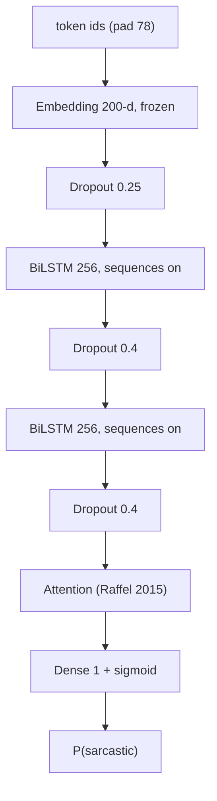

# Architecture

The project compares bag-of-vectors baselines to a two-layer bidirectional
LSTM with Raffel-style attention. Both families are trained twice: once
on word vectors only, once with emoji vectors in the mix.

## Baseline models

Trained in [`baseline_models.ipynb`](../baseline_models.ipynb). Each
sklearn estimator is fit on the mean-pooled features from
[`ml_read_data`](../data_utils.py).

| Estimator | Single-modal input | Multi-modal input | Pickle present? |
| --- | --- | --- | --- |
| SVM (`SVC`) | 200-d GloVe mean | 400-d concat | no |
| Decision Tree | 200-d | 400-d | `dt_classifier.pkl`, `dt_classifier_we.pkl` |
| Random Forest | 200-d | 400-d | no |
| Gradient Boosting | 200-d | 400-d | `gbt_classifier.pkl`, `gbt_classifier_we.pkl` |

`_we` in a filename means “with emoji” (the 400-d view).

The `except FileNotFoundError` branches in the baseline notebook have
copy-paste bugs: the Decision Tree multi-modal fallback trains an
`SVC`, and the Random Forest / GBT single-modal fallbacks also train an
`SVC`. Those branches only run when the pickle is missing. Prefer the
recorded notebook outputs in [results.md](results.md) over a fresh run
of the fallback path.

A dependency-free walkthrough of the same *shape* of experiment lives
in [`examples/toy_pipeline.py`](../examples/toy_pipeline.py).

## Deep model

Built by [`PrepModel`](../dl_model.py):

```text
Embedding(vocab, 200, weights=GloVe/emoji matrix, trainable=False)
  → Dropout(0.25)
  → Bidirectional(LSTM(256, return_sequences=True))
  → Dropout(0.4)
  → Bidirectional(LSTM(256, return_sequences=True))
  → Dropout(0.4)
  → Attention()          # (batch, steps, 512) → (batch, 512)
  → Dense(1, sigmoid)
```

Compiled with `Adam(lr=0.001)` and `binary_crossentropy`. The
`lr=` argument is the Keras 2 name; modern `tf.keras` wants
`learning_rate=`.

The saved-model summaries in
[`evaluate_loaded_dl_models.ipynb`](../evaluate_loaded_dl_models.ipynb)
report:

* input length 78 (padded training tweets)
* BiLSTM widths 512 (= 256 forward + 256 backward)
* ~2.51M parameters, all trainable at load time because the embedding
  layer was serialized through a `ModuleWrapper` (a TF 2 / Keras 2
  mixing artifact). The *training* code sets `trainable=False` on the
  embedding.



Single-modal vs multi-modal deep models share this graph. The difference
is the embedding matrix: multi-modal allows an emoji2vec fallback for
tokens that miss GloVe. See [preprocessing.md](preprocessing.md).

## Attention layer

[`attention_layer.py`](../attention_layer.py) is a Keras 2 layer after
Raffel & Ellis 2015 ([arXiv:1512.08756](https://arxiv.org/abs/1512.08756)).

For an encoder sequence `x` of shape `(batch, steps, features)`:

```text
e_t = tanh(x_t · W + b_t)          # W: (features,), b: (steps,)
a_t = exp(e_t) ⊙ mask_t
a   = a / (sum_t a_t + ε)
h   = sum_t a_t x_t                # (batch, features)
```

`ε` is `K.epsilon()` so an all-masked row does not become NaN. The mask
is consumed here (`compute_mask` returns `None`).

The NumPy twin used in the examples is
[`examples/attention.py`](../examples/attention.py). Run:

```bash
python examples/attention_demo.py
```

to see the weights concentrate on `#not` when `W` is aligned with the
sarcasm-hashtag axis.

A design note: `b` is a *per-timestep* bias of length `steps`, so the
layer is tied to the padded length it was built with (78 in the saved
models). That is the Raffel feed-forward attention used in many Keras
2 examples; it is not the same as a query-key attention head.

## Code map

| Path | What it is |
| --- | --- |
| [`data_utils.py`](../data_utils.py) | Read, tokenize, mean-pool, build the embedding matrix |
| [`attention_layer.py`](../attention_layer.py) | Keras attention used by `PrepModel` |
| [`dl_model.py`](../dl_model.py) | Sequential BiLSTM + attention constructor |
| [`baseline_models.ipynb`](../baseline_models.ipynb) | Train / load sklearn baselines, print accuracy |
| [`evaluate_loaded_dl_models.ipynb`](../evaluate_loaded_dl_models.ipynb) | Reload the two SavedModels, print accuracy |
| [`get_metrics_of_models.ipynb`](../get_metrics_of_models.ipynb) | Accuracy / F1 / precision / recall + comparison plot |
| [`examples/`](../examples/) | Dependency-light walkthroughs of the same ideas |
| [`docs/`](.) | This documentation set |
